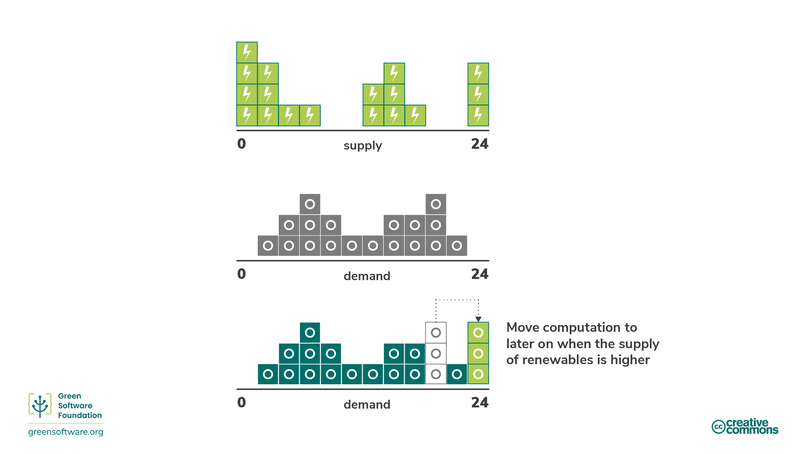

# green-software-is-cool

A gentle summary of the [Linux Foundation Green Software For Practitioners](https://training.linuxfoundation.org/training/green-software-for-practitioners-lfc131/) course. The Green Software Foundation maintains a [learning portal](https://learn.greensoftware.foundation/) which has more information about the subject.

## 1. Introduction

### 1.1 What is Green Software?

* Green software is an emerging discipline at the intersection of climate science, software design, electricity markets, hardware, and data center design.
* Green software is carbon-efficient software, meaning it emits the least carbon possible.
* Green software includes the following priciples:
  * **Carbon Efficiency**: emit the least amount of carbon possible.
  * **Energy Efficiency**: use the least amount of energy possible.
  * **Carbon Awareness**: do more when the electricity is cleaner and do less when the electricity is dirtier.
  * **Hardware Efficiency**: use the least amount of embodied carbon possible.
  * **Measurement**: what you can't measure, you can't improve.
  * **Climate Commitments**: understand the exact mechanism of carbon reduction.

### 1.2 Green Software Hierarchy

1. **Green Software Principles**: core concepts in green software.
2. **Green Software Patterns**: specific methods to apply one or more principles in real-world product that is not vendor specific.
3. **Green Software Practices**: cases of a pattern applied to a specific vendor's product.

Practices should refer to patterns and patterns should refer to principles. See Figure 1 fore clearer view of the hierarchy. The Green Software Foundation also maintains a full list of patterns, which can be found [here](https://patterns.greensoftware.foundation/).

|  |
| :---: |
| Figure 1: Green Software Hierarchy |

## 2. Carbon Efficiency

### 2.1 What Is Carbon Efficiency?

* Carbon is often used as a broad term to refer to the impact of all types of emissions and activities on global warming.
* CO2eq is a measurement term used to measure the impact of greenhouse gasses.
* Carbon efficient...
  * is minimizing the amount of carbon emitted per unit of work.
  * is about building applications that add the same value but emit less carbon.

### 2.2 Carbon Emissons Monitoring Pacts

* **Intergovernmental Panel on Climate Change (est. 1988)**
  * An organization which provide governments with scientific information that they can use to develop climate policies.
  * Reports are also a key input into international climate change negotiations.
* **United Nations Framework Convention on Climate (est. 1994)**
  * A group created to achieve the stabilization of greenhouse gas concentrations.
* **Conference of the Parties (est. 1995)**
  * An annual event involving all parties in the United Nations Framework Convention on Climate Change. At the conference
  * Reviews and assesses each party member's progress on tackling global warming
  * Topics include strategies to reduce carbon, financing low carbon strategies and preservation of natural habitats.
* **Paris Climate Agreement (est. 2015)**
  * An international treaty by UN to reduce temperature increase (compared to pre-industrial levels 2°C or a preferable lower limit of 1.5°C).
  * Reviewed every 5 years.
  * Every party is expected to update its progress through a Nationally Determined Contribution (NDC).

## 3. Energy Efficiency

### 3.1 What Is Energy Efficiency?

* Energy is the ability to do work and it is a measure of the amount of electricity used.
* Most electricity comes from burning fossil fuels and electricity is considered a proxy for carbon.
* To be energy efficient, we have to use the least amount of energy possible per unit of work.

### 3.2 Types of Energy

* **Clean Energy**: Doesn’t produce carbon emissions, e.g. nuclear.
* **Green Energy**: Sources from nature, e.g. wind.
* **Renewable Energy**: Sources will not expire, e.g. solar.

### 3.3 Energy Effiency Metrics

* **Power Usage Effectiveness (PUE)**
  * Ratio between "energy used by computer" and "energy used by cooling and other overheads supporting the compouter".
  * A multiplier to your app's energy consumption; i.e. an app that uses 10kWh in a PUE 1.5 environment actually uses 15kWH in total.
* **Energy Proportionality**
  * Relationship between "power consumed by computer" and "rate at which useful work is done (utilization)".
* **Utilization**
  * How much of a computer's resources are used, in percentage.
  * Computers running at its maximum capacity has a high percentage; idle computers has a lower percentage.
* **Static Power Draw**
  * How much electricity is drawn when a computer is in its idle state.

### 3.4 Energy Efficiency Key Concepts

* Green software is designed them to consume as little energy as possible; this includes both the software itself and the action of its end users.
* Green software is mindful of the PUE.
* Static power draw is always positive and therfore energy proportionality increases with computer utilization. See Figure 2.
* Workloads should be run on as few servers as possible, at the highest utilization rate, to maximize energy efficiency.

|  |
| :---: |
| Figure 2: Power vs. Utilization |

## 4. Carbon Awareness

### 4.1 What Is Carbon Awareness?

* **Carbon Intensity**: How much carbon (carbon dioxide equivalent) is emitted per kWH of electricity; the standard unit is gCO2eq/kWh.
* Do more when more energy comes from low carbon-intense sources, e.g. solar farms.
* Do less when more energy comes from high carbon-intense sources, e.g. coal power plants.

### 4.2 What Affects Carbon Intensity?

* Location: Some regions have an energy mix containing more clean energy sources than others.
* Time: Renewable energy is largely affected by weather conditions.
* **Dispatchability**: How easy is it to produce energy on demand. High for fossil fuels; low for renewables.
* **Curtailment**: Some electricity is throw away when more is produced than required.

### 4.3 Energy Grid Behavior

Supply always have to meet demand:

* If supply < demand: voltage decrease, brown-out.
* If demand > supply: circuit breakers are triggered, black-out.

The concept of marginal power plant is therefore considered:

* **Marginal Power Plant**: Power plant that provides power to sudden increase in energy demand.
* **Marginal Power Intensity**: Carbon intensity of the power plant that would have to be employed to meet any new demand.
* Since marginal power plant has to be dispatchable...
  * They are often powered by fossil fuels.
  * Marginal power intensity is usually high.
* Since fossil fuels plants have a minimum functioning threshold (they are consistent & always-on baseload)...
  * Sometimes renewables are curtailed while still consuming energy from fossil fuel power plants.
  * Carbon intensity of marginal power plant is 0 gCO2eq/kWh since new demand will match the renewables being curtailed.
  * Marginal power intensity is low.

What happens when demand falls below supply?

* Buy less energy from fossil fuel plants. Preferred since...
  * Fossil fuel power is more expensive.
  * Burns less fossil fuel.
* Buy less energy from renewable sources. Not preferred since...
  * Renewable power is cheaper.

What happens when supply falls below demand?

* Buy more energy from renewable sources that are currently being curtailed. Preferred since...
  * Curtailed renewable energy will be the cheapest dispatchable energy source.
* Buy more energy from fossil fuel plants. Not preferred since...
  * Coal costse money.

### 4.4 Carbon Awareness Key Concepts

1. Reducing electricity consumed can help decrease the energy's carbon intensity as the first thing to be scaled back are fossil fuels.
2. Primary driver for the transition is economic and not sustainability targets. Best way to ensure money flows in the right direction is to make sure you use electricity with the least carbon intensity.

To achieve this, the following techniques are used:

* **Demand Shifting**: Run workloads when and where the carbon intensity is lower.
  * **Spacial Demand Shifting**: moving your computation to another physical location.
  * **Temporal Demand Shifting**: move your computation to later in the day or night when it's sunnier or windier.
  * Carbon intensity can be well predicted through advances in weather forecasting.
  * E.g. Google Carbon Aware Data Centers and Microsoft Carbon Aware Windows.
* **Demand Shaping**: When the carbon cost of running your application becomes high, shape the demand to match the supply of carbon.
  * This can happen automatically or by presenting the user with a choice.
  * E.g. eco mode. Since there is this trade-off with performance, a user should be given the choice.

Green software prefers demand shaping to demand shifting.

## 5. Hardware Awareness

### 5.1 What Is Hardware Awareness?

* **Embodied Carbon**: A.k.a. embedded carbon, is the amount of carbon emitted during the creation and disposal of a device.
* **Amortization**: the "average" of carbon released over the expected life span of a device. E.g., building a server releases 4000 kgCO2eq and it will last four years > server emits 1000 kgCO2eq/year.
* Hardware awarness is understanding that every device is responsible for the release of carbon over its lifetime.

### 5.2 Hardware Awareness Key Concepts

Practices to increase hardware efficiency include the following:

* End-user Devices
  * Extend the lifespan of the hardware.
* Cloud Computing
  * Increase utilization of the device.
  * I.e. Better to use one server at 100% utilization than 5 servers at 20% utilization because of the cost of embodied carbon.

Hardware will always break down eventually, but supporting older hardware can extend their lifespan.

> Moving operations to the cloud will not reduce your emissions, it simply provides the opportunity to do so.

## 6. Measurement

The Greenhouse Gas Protocol (GHG Protocol) is the current standard for calculating the carbon released by any organization or individual. The Software Carbon Intensity Specification (SCI Specification) is used to measure rate of software emissions and designed to incentivize the elimination of emissions.

### 6.1 Greenhouse Gas Protocol (GHG Protocol)

Under the GHG protocol, emissions are categorized into 3 scopes:

* Scope 1: Direct emissions from operations owned or controlled by the reporting organization, such as on-site fuel combustion or fleet vehicles.
* Scope 2: Indirect emissions related to emission generation of purchased energy, such as heat and electricity.
* Scope 3: Other indirect emissions from all the other activities you are engaged in. Including all emissions from an organization's supply chain; business travel for employees, and the electricity customers may consume when using your product. A.k.a. **value chain emissions** (VCE).

For software, see the following table:

| Scope         | 1     | 2             | 3                        |
| :------------ | :---: | :-----------: | :----------------------: |
| Private Cloud | -     | Energy        | Embodied                 |
| Public Cloud  | -     | -             | Energy + Embodied        |
| Hybrid Cloud  | -     | Energy (Part) | Energy (Part) + Embodied |
| Front End     | -     | -             | Energy + Embodied        |

### 6.2 Software Carbon Intensity Specification (SCI Specification)

* SCI Specification calculates the rate of emissions while GHG Protocol calculates the total emissions.
* SCI focus on elimination while GHG Protocol focus on emissions.
* SCI Specification categorizes emissions into...
  * **Operational Emissions**: Carbon emissions from the running of software.
  * **Embodied Emissions**: Ccarbon emissions from the physical resources required to run the software.
* SCI score represents intensity rather than a total, which is more inclusive of open-source software.
* SCI score cannot be decreased by offsets either through neutralizations, compensations, or by offsetting electricity in the form of renewable energy credits.
* SCI score will only decrease if you make your application more energy efficient, hardware efficient, or carbon aware.

SCI score can be calculated by the following formula:

$SCI = ((E \times I) \times M) / R = C / R$

$E$ = Energy consumed by a software system; $I$ = Location-based marginal carbon emissions; $M$ = Embodied emissions of a software system; $R$ = Functional unit, e.g. carbon per additional user, API-call, ML job, etc.; $C$ = Carbon emissions.

> SCI specification does not specify software boundaries, but you should include all supporting infrastructure and systems that contribute to the software operation. It also does not currently describe the functional units and you are free to pick whichever best describes how your application scales. This means that SCI score is dependent on software boundary and the chosen functional unit, which makes it is essential for you to disclose them when you present your score.

### 6.3 Quantification Methods

* **Measurement**: using counters of some form. E.g., measuring the energy consumption using a hardware device in the wall socket.
* **Calculation**: using a model of some form. E.g., measure your application's energy consumption based on the CPU utilization.

## 7. Climate Commitments

### 7.1 Emission Offset Methods

* **Abatement** is the elimination of sources of CO2 emissions in operations and value chain so that they do not enter the atmosphere at all.
* **Offsets** are investments in emission-reduction projects through the purchase of carbon credits on the voluntary carbon market. Voluntary carbon market is where private actors trade carbon credits that represent certified removals or reductions of greenhouse gasses. 1 carbon credit = 1 tonne of CO2.
* **Compensations** are actions that companies take to help society avoid or reduce emissions outside of their value chain, which includes:
  * Conservation, credits are created based on carbon not released through protecting old trees.
  * Community projects, which helps undeveloped societies by introducing sustainable living methods.
  * Waste to energy projects, which capture landfill gas (e.g. methane) and convert it into electricity.
* **Neutralizations** are actions that companies take to remove carbon from the atmosphere within or beyond their value chain, which includes:
  * Enhancing natural carbon sinks that remove CO2 from the atmosphere, e.g., forest restoration.
  * Direct air capture is the process of capturing CO2 from the air and storing it permanently, either underground or in long-lived products like concrete.

Note that different neutralizaiton methods have different **durability**:

* Short-term durability is up to 100 years.
* Medium-term durability is 100 to 1,000 years.
* Long-term durability is more than 1,000 years.

> Never releasing carbon is far better than releasing carbon and then trying to keep it out of the atmosphere for 5,000 years.

### 7.2 Carbon Neutral

* To achieve **carbon neutrality**, all emission must be offset through carbon reduction projects (compensations and neutralizations acceptable).
* This includes emissions from Scope 1, Scope 2, and at least business travel from Scope 3.

### 7.3 Net-Zero

* To achieve **net-zero**, emissions must be reduced according to the latest climate science and residual emissions must be balanced carbon removals (neutralizations only).
* This includes emissions from all 3 scopes. This is significant since value chain emissions often represents the majority of emissions.
* Net-zero strategy means carbon in the atmosphere remains constant.

> Net-zero focus on abatement while carbon neutrality focuses on neutralizations and compensations.

### 7.4 100% Renewable

* **100% renewable** has two types:
  * **Powered by** means the organization is directly powered by a renewable power source.
  * **Matched by** means the organization buy enough renewable energy certificates (RECs) to cover the amount of electricity you consume (1 REC = 1kWh of clean energy).

> Power Purchase Agreement (PPA) is another way to achieve 100% Renewable, which is an agreement to buy a certain amount of energy from a renewable plant. PPAs encourage **additionality**, which means it drives the creation of new renewable plants.

### 7.5 24/7 Matched

* 100% Renewable does not mean energy demand is met every hour of the day. See Figure 2.
* **24/7 Matched** means that the organization is 100% Renewable every hour of the day.
* **Carbon-Free Energy** (CFE) is used to describle how close to 24/7 matching. Defined officially as the average percentage of carbon-free energy consumed in a particular location on an hourly basis.

|  |
| :---: |
| Figure 3: 24//7 Matched |

Carbon awareness helps an organization meet their 24/7 matching target and increase its CFE percentage.

## Reference

1. *Green Software For Practitioners - Linux Foundation Training*. Available at: [https://training.linuxfoundation.org/training/green-software-for-practitioners-lfc131/](https://training.linuxfoundation.org/training/green-software-for-practitioners-lfc131/). (Accessed: April 11, 2023).
2. *Green Software Foundation | GSF*. Available at: [https://greensoftware.foundation/](https://greensoftware.foundation/). (Accessed: Aprill 11, 2023).
